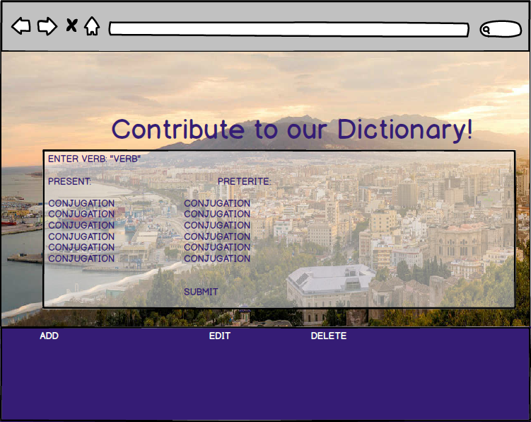

Enseñame Tus Verbos
-----------------------
Show me your verbs is a simple web application that allows the user to input a verb in the Spanish language and receive a conjugated format. Support is only available for the indicative mood and four tenses (conditional, future, present and preterite).

[Use the application here on Heroku](https://morning-anchorage-78915.herokuapp.com/)

Wireframes
----------
 


User Stories
------------
As a user, I want to be able to input a verb in the Spanish language and receive a conjugated format in the indicative tense.

As a user, I want to be able to receive said conjugation in the format of at least 4 four tenses.


Database
------------


  
	verb_table
	ID| VERB
	1 |	SER       
	2 |	ESTAR 
	
	CONJUGATION_PRESENT TABLE
	Verb_id|Verb    | Yo  | Tú | [Él/Ella/Usted]  | nosotros |vosotros |[ellos/ellas/Ustedes]
	1      |Ser     | soy |eres|	es            | somos    | sois    |       son
	
	
	CONJUGATION_PRETERITE TABLE
	Verb_id| Verb | Yo   | Tú         | [Él/Ella/Usted] | nosotros     |vosotros      |[ellos/ellas/Ustedes]
	  1    |Ser   | fui  |fuiste      |	fue             | fuimos       | fuisteis     |       fueron
	
	CONJUGATION_FUTURE TABLE
	Verb_id| Verb       | Yo   | Tú  | [Él/Ella/Usted] | nosotros   |vosotros     |[ellos/ellas/Ustedes]
	1      |    Ser     | seré |serás|	será           | seremos    | seréis      |       serán

	CONJUGATION_CONDITIONAL TABLE
	Verb_id| Verb    | Yo    | Tú     | [Él/Ella/Usted] | nosotros |vosotros |[ellos/ellas/Ustedes]
	1     |	Ser      | sería |seriás  |	sería           | seríamos | seríais |     serían
---


Technologies
-----------

- SQL: Creating the database and formatting queries.
- jQuery: Making the front end interactive
- Node.js: Back-end MVC-type design
- Express: Express Generator used. Node.js framework that quickly links server and configures routes
- Heroku: Cloud-based platform that stores API and web application
- Npm modules include:
	- pg-promise: Better coding flow, no need for callback functions in queries.js file.
   - nodemon: Automatically reloads the server when changes are applied to application.

Download Project & Install
----------------

1. [Git clone or download this project]('https://git.generalassemb.ly/Dashy10/Project-2')
2. Create a PostgreSQL database called 'spanish_verbs'
3. On your terminal:
 a: CD into spanish_conjugator_app && CD into models.
 b. Run psql -f schema.sql && psql -f seed.sql
 c. psql -d spanish_verbs & check to see that the database was properly seeded.
4. From spanish_conjugator_app, run:
 a: npm install
 b. npm install nodemon --save
 c. npm install pg-promise --save
5. Run npm rundev, app will be available on localhost:3000

Code Example(s)
---------------
``` JavaScript
$(function(){
let present_tenseURL = 'https://morning-anchorage-78915.herokuapp.com/present-tense/';
$('#get_verbs').on('click',function(e){
    e.preventDefault();
    $('.mostrame').css("opacity","1");
    let input = $('#verb_input').val();

    let verb = encodeURI(input);

    axios.get(present_tenseURL + verb)
    .then(function(res){
      displayYoPresent(res.data.data.yo)
      displayTuPresent(res.data.data.tú)
      displayThirdPresent(res.data.data.third)
      displayNosotrosPresent(res.data.data.nosotros)
      displayVosotrosPresent(res.data.data.vosotros)
      displayGroupPresent(res.data.data.group)
    });
    
    displayYoPresent = (yo) => {

  let all_present_tense_verbs = yo
  console.log(all_present_tense_verbs)
  $("#singular-first-present").empty().append(" " + yo);
}
```
Contributing
----------------
This project was developed as part of the Web Development Immersive program at General Assembly in NYC, May 2017.

Instructors: Patrick Andre, Joe Keohan, Jon Zachary

TA's: Matt Kersner, Dominic Farquharson & Daniel Pease.

Minimum Viable Product
----------------

- Giving the user the ability to input a verb and receive four conjugated tenses

- Giving the user the ability to enter a verb with conjugations into the database based on tense.

Major Hurdles
----------------

- Properly formatting the database for querying

- Engineering front-end features 


Future Improvements
----------------
- Implementation of passport middleware for user authentication

- Giving an authenticated user the ability to create new verb entries and insert their own conjugations into the database.


Author(s)
----------------
[Dashiell Lumas](dashiell.lumas@gmail.com)